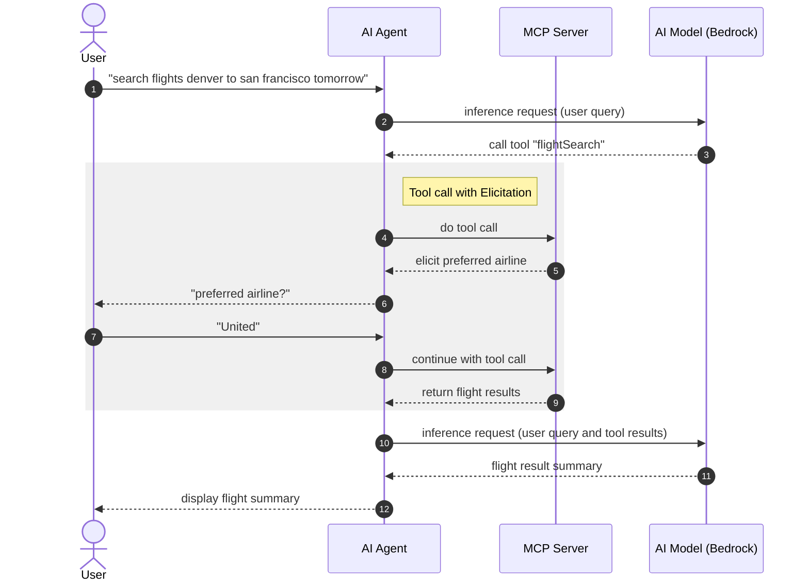

# Spring AI MCP Elicitation Demo

## Setup

### AWS Credentials

This demo uses AWS Bedrock, which requires valid AWS credentials. Configure your `~/.aws/config` with SSO:

```
[default]
sso_session = your-sso-session
sso_account_id = your-account-id
sso_role_name = YourRoleName
region = us-west-2

[sso-session your-sso-session]
sso_start_url = https://your-org.awsapps.com/start/#
sso_region = us-west-2
sso_registration_scopes = sso:account:access
```

Then login:
```
aws sso login
```

Verify credentials are working:
```
aws sts get-caller-identity
```

### Running the Demo

Start the MCP server:
```
./gradlew :server:bootRun
```

Explore in the MCP Inspector `http://localhost:8081/mcp`

In another terminal (with the same AWS credentials configured), run the MCP client:
```
./gradlew :client:bootRun
```

In the client's console, ask:
```
search flights denver to san francisco tomorrow
```



## How It Works

This demo shows how a Spring AI application can use AWS Bedrock for AI inference and MCP (Model Context Protocol) for tool communication between a client and server.

### Architecture Overview

The demo consists of two Spring Boot applications that both call AWS Bedrock, connected via MCP:

- **Client**: Takes user requests, sends them to Bedrock, and executes tool calls via MCP
- **Server**: Exposes tools via MCP and uses Bedrock to generate flight data

### Client Flow

The client application starts and sends a test request to AWS Bedrock. See `client/src/main/java/com/jamesward/springaimcpdemo/Application.java`:

- Lines 37-40: The ChatClient sends the user's prompt to AWS Bedrock (Nova Lite model). Spring AI handles the Bedrock API call internally.
- Line 28: The client is configured with MCP tool callbacks, which means when Bedrock responds with a tool call, Spring AI automatically routes it to the MCP server.
- Lines 59-79: When the MCP server requests additional information (elicitation), this handler responds with default values.

### Server Flow

The server exposes MCP tools that the client can call. See `server/src/main/java/com/jamesward/springaimcpdemo/Application.java`:

- Lines 112-139: The `searchFlights` method is annotated with `@McpTool`, making it available to MCP clients. When the client calls this tool, it executes on the server.
- Lines 68-72: Inside `FlightSearchService`, another call to AWS Bedrock (Nova Pro model) generates the flight data. This is a separate Bedrock call from the client's call.

### Bedrock Calls

There are two separate AWS Bedrock calls in this demo:

1. **Client to Bedrock**: The client sends the user's natural language request to Bedrock. Bedrock interprets the request and decides to call the `searchFlights` tool.

2. **Server to Bedrock**: When the `searchFlights` tool executes, the server calls Bedrock again to generate realistic flight data based on the search parameters.

### MCP Communication

MCP handles the communication between client and server:

- The client connects to the server's MCP endpoint at `http://localhost:8081/mcp`
- The server advertises available tools (like `searchFlights`) via MCP
- When Bedrock tells the client to call a tool, the client sends an MCP request to the server
- The server executes the tool and returns results via MCP
- The client passes the results back to Bedrock for final response generation

## Configuration

### Client Configuration

See `client/src/main/resources/application.properties`:

**MCP Connection**: The client connects to MCP servers using named connections. The property `spring.ai.mcp.client.streamable-http.connections.flights.url` defines a connection named "flights" that points to the MCP server. The name "flights" is used in the elicitation handler to identify which server is requesting information. By default it connects to `http://localhost:8081`, but you can override this by setting the `FLIGHTS_MCP_URL` environment variable.

**Bedrock Model**: The client uses `us.amazon.nova-2-lite-v1:0` for processing user requests. This is a smaller, faster model suitable for orchestration and tool routing.

**AWS Region**: Defaults to `us-west-2` but can be overridden with the `AWS_REGION` environment variable.

### Server Configuration

See `server/src/main/resources/application.properties`:

**MCP Protocol**: The server uses `STREAMABLE` protocol mode, which supports session-based streaming communication. The server type is `SYNC`, meaning tool calls are processed synchronously.

**Tool Discovery**: The setting `spring.ai.mcp.server.annotation-scanner.enabled=true` tells Spring AI to automatically discover methods annotated with `@McpTool` and expose them as MCP tools.

**Server Port**: The server listens on port 8081 by default. This can be changed by setting the `PORT` environment variable.

**Bedrock Model**: The server uses `us.amazon.nova-pro-v1:0` for generating flight data. This is a more capable model used for content generation.
