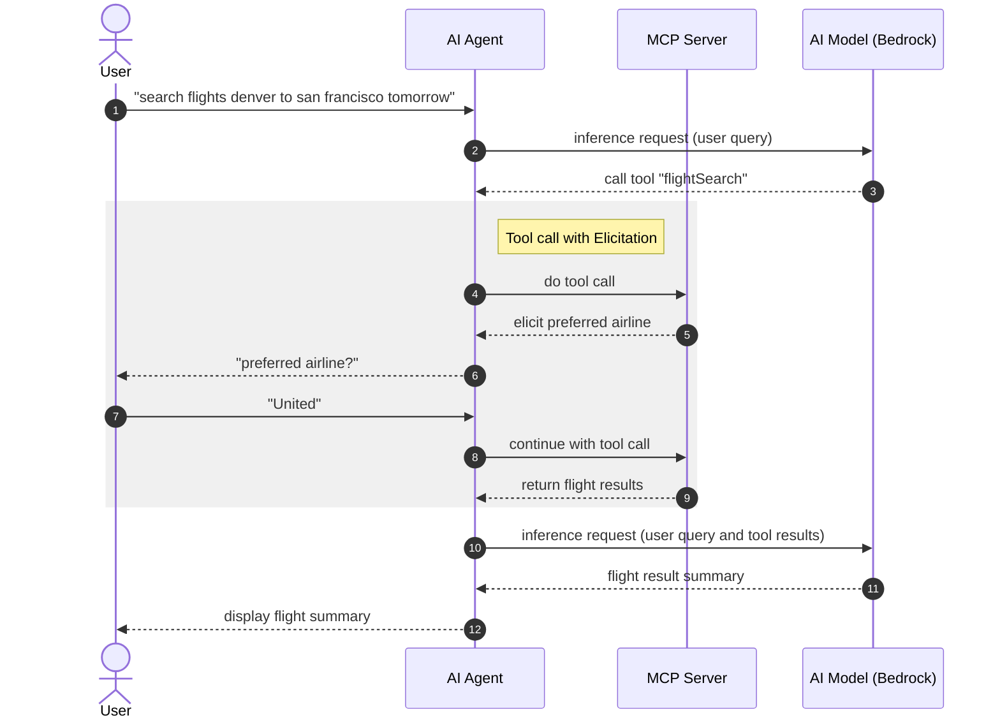

# Spring AI MCP Elicitation Demo

## Setup
1. [Create a Bedrock Bearer token](https://us-east-1.console.aws.amazon.com/bedrock/home?region=us-east-1#/api-keys/long-term/create)
2. Set the env var: `export AWS_BEARER_TOKEN_BEDROCK=YOUR_TOKEN`

Start the MCP server:
```
./gradlew :server:bootRun
```

Explore in the MCP Inspector `http://localhost:8081/mcp`


In another terminal, set `AWS_BEARER_TOKEN_BEDROCK` again and run the MCP client:
```
./gradlew :client:bootRun
```

In the client's console, ask:
```
search flights denver to san francisco tomorrow
```


