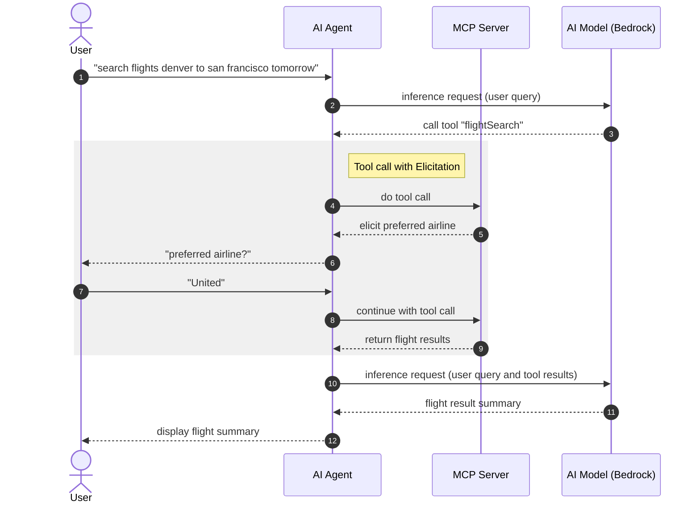

# Spring AI MCP Elicitation Demo

## Setup

### AWS Credentials

This demo uses AWS Bedrock, which requires valid AWS credentials. You can use either SSO or static credentials.

**Option 1: AWS SSO (Recommended)**

1. List your available AWS profiles:
   ```
   cat ~/.aws/config
   ```

2. Find a profile with Bedrock access (look for profiles with `sso_session` or static credentials).

3. Login with SSO (if using an SSO profile):
   ```
   aws sso login --profile YOUR_PROFILE_NAME
   ```

4. Set the profile environment variable:
   ```
   export AWS_PROFILE=YOUR_PROFILE_NAME
   ```

5. Verify credentials are working:
   ```
   aws sts get-caller-identity
   ```

**Option 2: Bearer Token**

1. [Create a Bedrock Bearer token](https://us-east-1.console.aws.amazon.com/bedrock/home?region=us-east-1#/api-keys/long-term/create)
2. Set the env var: `export AWS_BEARER_TOKEN_BEDROCK=YOUR_TOKEN`

### Running the Demo

Start the MCP server:
```
./gradlew :server:bootRun
```

Explore in the MCP Inspector `http://localhost:8081/mcp`

In another terminal (with the same AWS credentials configured), run the MCP client:
```
./gradlew :client:bootRun
```

In the client's console, ask:
```
search flights denver to san francisco tomorrow
```


